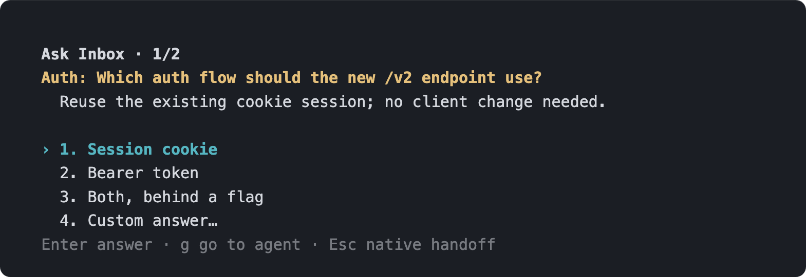
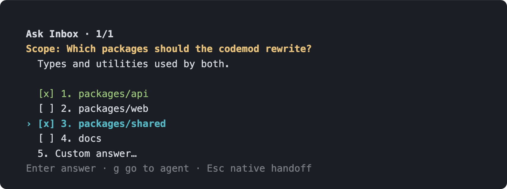
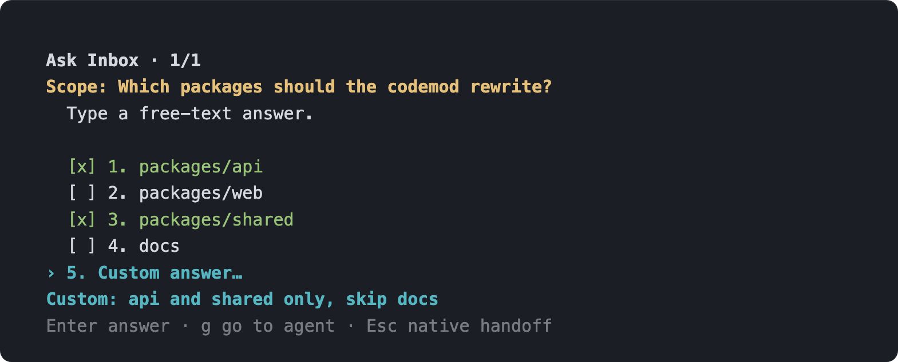

# Ask Inbox

<a id="korean"></a>
[🇰🇷 한국어](#korean) ｜ **🇺🇸 English**

<details>
<summary>한국어로 보기 (Click to expand Korean)</summary>

`cdragon.ask-inbox`는 Claude 에이전트가 `AskUserQuestion`으로 답을 기다릴 때, herdr 전체에서 하나의 FIFO 팝업으로 모아 그 자리에서 처리하는 플러그인입니다. 선택한 답변은 원래 에이전트에만 전달되며, 자동 승인은 하지 않습니다.



여러 워크스페이스에서 멈춰 있던 질문이 하나의 큐로 모입니다. 헤더의 `1/2`는 지금 보고 있는 질문이 대기 2건 중 첫 번째라는 뜻이고, 답을 고르면 곧바로 다음 질문이 같은 자리에 나타납니다. 질문을 찾아 pane을 돌아다닐 필요가 없습니다.

## 동작 방식

에이전트가 `AskUserQuestion`을 호출하면 PreToolUse hook이 요청을 큐에 넣고 **직접 팝업을 엽니다.** 팝업에서 답을 고르면 hook 응답으로 정확한 답이 원래 에이전트에 전달됩니다.

핵심은 **팝업이 살아있는 동안에만 기다린다**는 점입니다. 팝업이 뜨지 못하거나(예: 플러그인이 비활성) 도중에 닫히면, hook은 몇 초 안에 아무 결정도 반환하지 않고 종료하여 에이전트의 **네이티브 질문 UI로 돌려보냅니다.** 즉 이 플러그인 때문에 질문이 무한정 멈추는 일은 없습니다.

## 지원 범위

| 에이전트 | 대기 원인 | 처리 방식 |
| --- | --- | --- |
| Claude | `AskUserQuestion` | 팝업에서 원래 질문·선택지를 표시하고 hook 응답으로 정확한 답을 반환 |

Claude 권한 요청(`PermissionRequest`)과 Codex는 이 버전에서 다루지 않습니다. 권한 승인은 네이티브 UI에 맡겨 오배송 위험을 없앴습니다. 확신이 서지 않는 모든 경우(팝업 부재·닫힘·오류)는 원래 에이전트 UI로 되돌립니다.

## 설치

Node.js 22 이상과 herdr 0.7.5 이상이 필요합니다.

```bash
herdr plugin install speardragon/herdr-ask-inbox --yes
```

로컬에서 개발·수정하려면 클론한 뒤 로컬 링크로 설치합니다.

```bash
git clone https://github.com/speardragon/herdr-ask-inbox.git
herdr plugin link ./herdr-ask-inbox --enabled
```

설치(link/install) 과정의 build 단계는 Node 버전 확인과 전체 테스트를 실행한 뒤, Claude hook을 **자동으로 설치 또는 복구**합니다. 기존 설정 파일을 바꾸기 전에는 같은 디렉터리에 타임스탬프가 붙은 `.ask-inbox.bak` 백업을 만들며, 플러그인이 소유하지 않은 hook은 유지합니다. 설치되는 hook은 `AskUserQuestion` 하나뿐입니다.

설치 상태는 다음 명령으로 확인합니다.

```bash
herdr plugin action invoke hook-status --plugin cdragon.ask-inbox
```

대기열을 수동으로 열려면 다음 액션을 실행합니다.

```bash
herdr plugin action invoke open --plugin cdragon.ask-inbox
```

## 팝업 조작

- `↑`/`↓`, 숫자 키, `Space`, `Enter`: 항목을 선택하고 답변을 전달합니다. 여러 질문·다중 선택·자유 입력(Custom)을 지원합니다.
- `g`: 답변을 보내지 않습니다. 팝업을 닫고 해당 요청의 원래 에이전트 pane으로 포커스를 이동해 네이티브 UI에서 계속 처리합니다.
- `Esc`: 답변을 보내지 않고 팝업만 닫습니다. 에이전트는 네이티브 UI로 넘어가지만, 포커스는 이동하지 않아 지금 보던 화면에 그대로 머무릅니다.

다중 선택 질문에서는 `Space`로 여러 항목을 켜고 끈 뒤 `Enter`로 한 번에 보냅니다. 커서 아래 줄에는 항상 지금 선택지의 설명이 표시됩니다.



선택지에 없는 답을 주고 싶으면 마지막 `Custom answer…`에서 `Enter`를 누르고 직접 입력합니다. 입력한 문장이 그대로 에이전트의 답변이 됩니다.



팝업은 전 워크스페이스에서 하나만 열리고, 요청은 생성 순서대로 처리됩니다.

## 진단 및 복구

큐는 플러그인별 config directory 아래에 있습니다. 실제 경로는 다음으로 확인합니다.

```bash
herdr plugin config-dir cdragon.ask-inbox
```

대기 요청·팝업이 기대대로 보이지 않으면 먼저 `hook-status`로 `installed`/`missing`/`duplicate`/`changed` 상태를 확인하세요. `changed`는 사용자가 수정한 소유 hook일 수 있으므로 자동으로 덮어쓰지 말고 백업과 설정 내용을 검토한 뒤 `install-hooks`를 다시 실행합니다.

```bash
herdr plugin action invoke install-hooks --plugin cdragon.ask-inbox
```

플러그인이 비활성(`disabled`)이면 launcher가 즉시 종료하여 hook이 네이티브 UI로 fail-open 하므로, 비활성 상태에서도 질문이 멈추지 않습니다.

## 안전한 제거

다음 순서로 제거합니다.

```bash
herdr plugin action invoke uninstall-hooks --plugin cdragon.ask-inbox
herdr plugin action invoke hook-status --plugin cdragon.ask-inbox
herdr plugin unlink cdragon.ask-inbox
```

`uninstall-hooks`는 정확히 일치하는 플러그인 소유 hook만 제거합니다. 변경되었거나 중복된 marker hook은 보존하고 상태에 보고하므로, 해당 경우에는 설정과 `.ask-inbox.bak` 파일을 검토한 후 사람이 정리해야 합니다.

</details>

<a id="english"></a>

<details open>
<summary><strong>🇺🇸 English</strong></summary>

`cdragon.ask-inbox` is a herdr plugin that collects every pending `AskUserQuestion` from Claude agents — across all of herdr — into one FIFO popup you can answer right where you are. The chosen answer is delivered only to the agent that asked, and nothing is ever auto-approved.


Questions stalled across different workspaces all land in a single queue. The `1/2` in the header means you're looking at the first of two pending questions; picking an answer immediately brings up the next one in the same spot. No more hunting through panes to find who's waiting on you.

## How it works

When an agent calls `AskUserQuestion`, a PreToolUse hook enqueues the request and **opens the popup directly.** Picking an answer in the popup returns the exact answer to the original agent through the hook response.

The key idea: **it only waits while the popup is alive.** If the popup fails to open (e.g. the plugin is disabled) or gets closed mid-way, the hook returns no decision within a few seconds and exits, sending the agent back to its **native question UI.** This plugin can never cause a question to hang indefinitely.

## Support scope

| Agent | What it waits on | How it's handled |
| --- | --- | --- |
| Claude | `AskUserQuestion` | The popup shows the original question and options, then returns the exact answer via the hook response |

Claude permission requests (`PermissionRequest`) and Codex are out of scope for this version. Permission approval is left to the native UI to eliminate any risk of misdelivery. Every uncertain case — no popup, popup closed, or an error — falls back to the original agent's UI.

## Installation

Requires Node.js 22+ and herdr 0.7.5+.

```bash
herdr plugin install speardragon/herdr-ask-inbox --yes
```

To develop or modify it locally, clone the repo and install it as a local link.

```bash
git clone https://github.com/speardragon/herdr-ask-inbox.git
herdr plugin link ./herdr-ask-inbox --enabled
```

The build step of install/link checks the Node version and runs the full test suite, then **automatically installs or repairs** the Claude hook. Before touching an existing config file, it writes a timestamped `.ask-inbox.bak` backup in the same directory, and it leaves any hook it doesn't own untouched. Only one hook is installed: `AskUserQuestion`.

Check the install status with:

```bash
herdr plugin action invoke hook-status --plugin cdragon.ask-inbox
```

To open the pending queue manually, run:

```bash
herdr plugin action invoke open --plugin cdragon.ask-inbox
```

## Popup controls

- `↑`/`↓`, number keys, `Space`, `Enter`: select an item and deliver the answer. Supports multiple questions, multi-select, and free-text (Custom) answers.
- `g`: decline to answer. Closes the popup and focuses the original agent's pane so you can continue in its native UI.
- `Esc`: decline to answer and just close the popup. The agent still falls back to its native UI, but focus doesn't move — you stay on whatever you were looking at.

For multi-select questions, toggle items on and off with `Space`, then send them all at once with `Enter`. The description of the currently highlighted option is always shown just below the cursor.


If none of the options fit, pick the last `Custom answer…` entry, press `Enter`, and type your own. Whatever you type becomes the agent's answer verbatim.


Only one popup is ever open across the whole herdr instance, and requests are processed in the order they were created.

## Diagnostics & recovery

The queue lives under the plugin's config directory. Find the actual path with:

```bash
herdr plugin config-dir cdragon.ask-inbox
```

If pending requests or the popup aren't behaving as expected, first check `hook-status` for `installed`/`missing`/`duplicate`/`changed`. `changed` may mean a user-modified owned hook, so don't let it be overwritten automatically — review the backup and the config contents, then re-run `install-hooks`.

```bash
herdr plugin action invoke install-hooks --plugin cdragon.ask-inbox
```

If the plugin is `disabled`, the launcher exits immediately and the hook fails open to the native UI, so questions never hang even while the plugin is off.

## Safe removal

Remove the plugin in this order:

```bash
herdr plugin action invoke uninstall-hooks --plugin cdragon.ask-inbox
herdr plugin action invoke hook-status --plugin cdragon.ask-inbox
herdr plugin unlink cdragon.ask-inbox
```

`uninstall-hooks` only removes plugin-owned hooks that match exactly. Any changed or duplicate marker hook is preserved and reported in the status instead, in which case a human needs to review the config and the `.ask-inbox.bak` file and clean it up manually.

</details>
